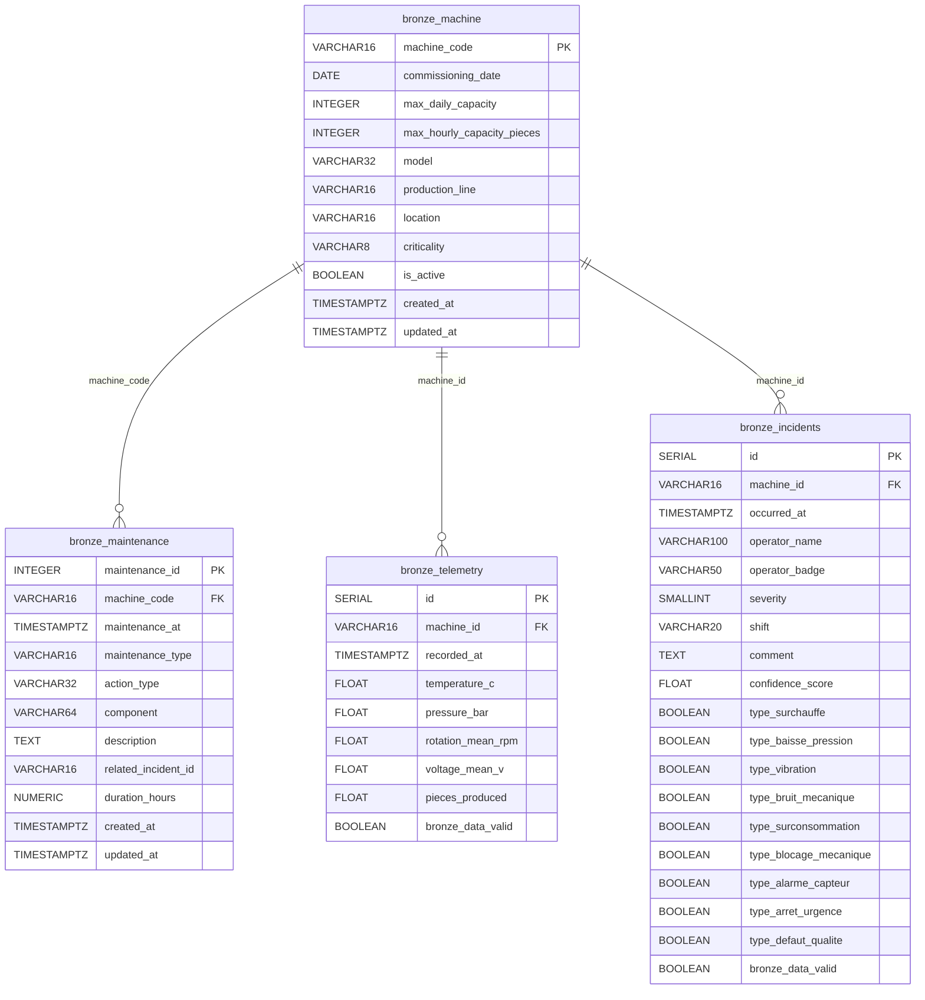

# Couche Bronze — transformations appliquées

La commande `uv run python main.py bronze_from_raw` est **rejouable** : elle tronque les tables
bronze avant de les repeupler depuis les tables raw. Elle peut être lancée autant de fois que
nécessaire sans créer de doublons.

## Tables produites

| Table bronze          | Source raw         |
|-----------------------|--------------------|
| `bronze_machine`      | `machine`          |
| `bronze_maintenance`  | `maintenance`      |
| `bronze_telemetry`    | `raw_telemetry`    |
| `bronze_incidents`    | `raw_incidents`    |

## Périmètre

Bronze = **copie fidèle** des données raw avec typage et contraintes. Les transformations
métier (déduplication, normalisation des unités, imputation) appartiennent à la couche **Silver**.

## Transformations

### 1. Format de date ISO 8601 (UTC)

Les colonnes `recorded_at` (telemetry) et `occurred_at` (incidents) sont stockées dans les tables
raw en `TIMESTAMP WITHOUT TIME ZONE`. Dans les tables bronze, elles sont converties en
`TIMESTAMP WITH TIME ZONE` (UTC), garantissant un format ISO 8601 non ambigu.

```
raw   : 2024-03-15 08:42:00          (naive, type TIMESTAMP)
bronze: 2024-03-15 08:42:00+00:00   (UTC,   type TIMESTAMPTZ)
```

### 2. Foreign key sur les machines

La colonne `machine_id` (valeurs : `MACH-01` … `MACH-15`) référence désormais
`bronze_machine.machine_code` via une contrainte `FOREIGN KEY` PostgreSQL.

- Les lignes dont le `machine_id` n'existe pas dans `bronze_machine` sont **exclues** avec un
  avertissement (plutôt que de faire échouer tout le chargement).
- La couche bronze est **auto-contenue** : `bronze_telemetry`, `bronze_incidents` et
  `bronze_maintenance` se joignent directement à `bronze_machine` sans passer par les tables raw.

## Règles métier (`bronze_data_valid`)

La colonne `bronze_data_valid` (BOOLEAN NOT NULL) est calculée à l'ingestion. Elle ne filtre
aucune ligne — toutes les lignes raw sont conservées — mais marque celles qui violent une règle
métier afin que les couches aval puissent les ignorer ou les traiter séparément.

| Table               | Règle                                                         |
|---------------------|---------------------------------------------------------------|
| `bronze_telemetry`  | `true` si le couple `(machine_id, recorded_at)` est unique dans la table |
| `bronze_incidents`  | `true` si `severity` est compris entre 1 et 5 inclus         |

## Schéma des tables bronze



### `bronze_machine`

| Colonne                      | Type         | Contrainte                              |
|------------------------------|--------------|-----------------------------------------|
| `machine_code`               | VARCHAR(16)  | PK                                      |
| `commissioning_date`         | DATE         | NOT NULL                                |
| `max_daily_capacity`         | INTEGER      | NOT NULL                                |
| `max_hourly_capacity_pieces` | INTEGER      | NOT NULL                                |
| `model`                      | VARCHAR(32)  | NOT NULL                                |
| `production_line`            | VARCHAR(16)  | NOT NULL                                |
| `location`                   | VARCHAR(16)  | NOT NULL                                |
| `criticality`                | VARCHAR(8)   | NOT NULL — `LOW` / `MEDIUM` / `HIGH`    |
| `is_active`                  | BOOLEAN      | NOT NULL                                |
| `created_at`                 | TIMESTAMPTZ  | NOT NULL                                |
| `updated_at`                 | TIMESTAMPTZ  | NOT NULL                                |

### `bronze_maintenance`

| Colonne                | Type          | Contrainte                           |
|------------------------|---------------|--------------------------------------|
| `maintenance_id`       | INTEGER       | PK (conservé depuis la source)       |
| `machine_code`         | VARCHAR(16)   | FK → `bronze_machine.machine_code`   |
| `maintenance_at`       | TIMESTAMPTZ   | NOT NULL — UTC ISO 8601              |
| `maintenance_type`     | VARCHAR(16)   | NOT NULL — `proactive` / `reactive`  |
| `action_type`          | VARCHAR(32)   | NOT NULL                             |
| `component`            | VARCHAR(64)   | NOT NULL                             |
| `description`          | TEXT          | NOT NULL                             |
| `related_incident_id`  | VARCHAR(16)   | nullable                             |
| `duration_hours`       | NUMERIC(6,2)  | NOT NULL                             |
| `created_at`           | TIMESTAMPTZ   | NOT NULL                             |
| `updated_at`           | TIMESTAMPTZ   | NOT NULL                             |

### `bronze_telemetry`

| Colonne             | Type            | Contrainte                          |
|---------------------|-----------------|-------------------------------------|
| `id`                | SERIAL PK       |                                     |
| `machine_id`        | VARCHAR(16)     | FK → `bronze_machine.machine_code`         |
| `recorded_at`       | TIMESTAMPTZ     | NOT NULL — UTC ISO 8601             |
| `temperature_c`     | FLOAT           |                                     |
| `pressure_bar`      | FLOAT           |                                     |
| `rotation_mean_rpm` | FLOAT           |                                     |
| `voltage_mean_v`    | FLOAT           |                                     |
| `pieces_produced`   | FLOAT           |                                     |
| `bronze_data_valid` | BOOLEAN         | NOT NULL — `false` si doublon sur `(machine_id, recorded_at)` |

### `bronze_incidents`

| Colonne                 | Type            | Contrainte                          |
|-------------------------|-----------------|-------------------------------------|
| `id`                    | SERIAL PK       |                                     |
| `machine_id`            | VARCHAR(16)     | FK → `bronze_machine.machine_code`         |
| `occurred_at`           | TIMESTAMPTZ     | UTC ISO 8601                        |
| `operator_name`         | VARCHAR(100)    |                                     |
| `operator_badge`        | VARCHAR(50)     |                                     |
| `severity`              | SMALLINT        |                                     |
| `shift`                 | VARCHAR(20)     |                                     |
| `comment`               | TEXT            |                                     |
| `confidence_score`      | FLOAT           |                                     |
| `type_surchauffe`       | BOOLEAN         | NOT NULL                            |
| `type_baisse_pression`  | BOOLEAN         | NOT NULL                            |
| `type_vibration`        | BOOLEAN         | NOT NULL                            |
| `type_bruit_mecanique`  | BOOLEAN         | NOT NULL                            |
| `type_surconsommation`  | BOOLEAN         | NOT NULL                            |
| `type_blocage_mecanique`| BOOLEAN         | NOT NULL                            |
| `type_alarme_capteur`   | BOOLEAN         | NOT NULL                            |
| `type_arret_urgence`    | BOOLEAN         | NOT NULL                            |
| `type_defaut_qualite`   | BOOLEAN         | NOT NULL                            |
| `bronze_data_valid`     | BOOLEAN         | NOT NULL — `false` si `severity` hors [1, 5] |
